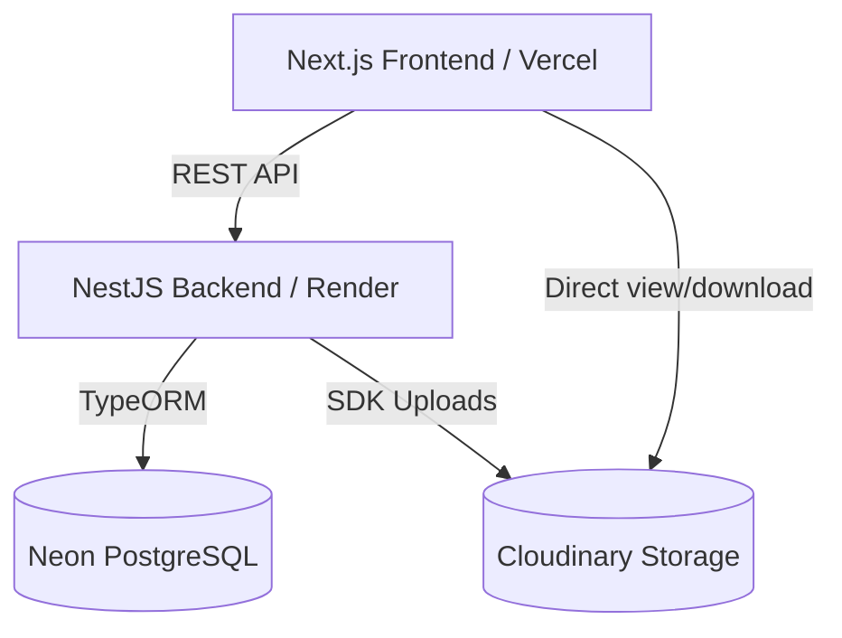

# System Architecture

## High-Level Architecture

## Infrastructure Providers
1. **Vercel**: Hosts the Next.js 15 frontend application, leveraging Edge caching.
2. **Render**: Hosts the NestJS backend API.
3. **Neon**: Serverless PostgreSQL database provider.
4. **Cloudinary**: Handles all asset storage (avatars, post images, PDF notes, etc.).

## Core Architectural Modules
- **Auth Module**: Handles Passport strategies for both Google and Local (Email/Password). Issues JWTs.
- **Hierarchy Module**: Manages the strict tree of `University > Course > Semester > Subject > ResourceType`.
- **Resource Module**: Handles the actual notes/files uploaded by users, linked to Cloudinary URLs and the Hierarchy Module.
- **Social Module**: Handles Messaging, Friendships, Likes, Comments.
- **Moderation Module**: Handles user Reports.
